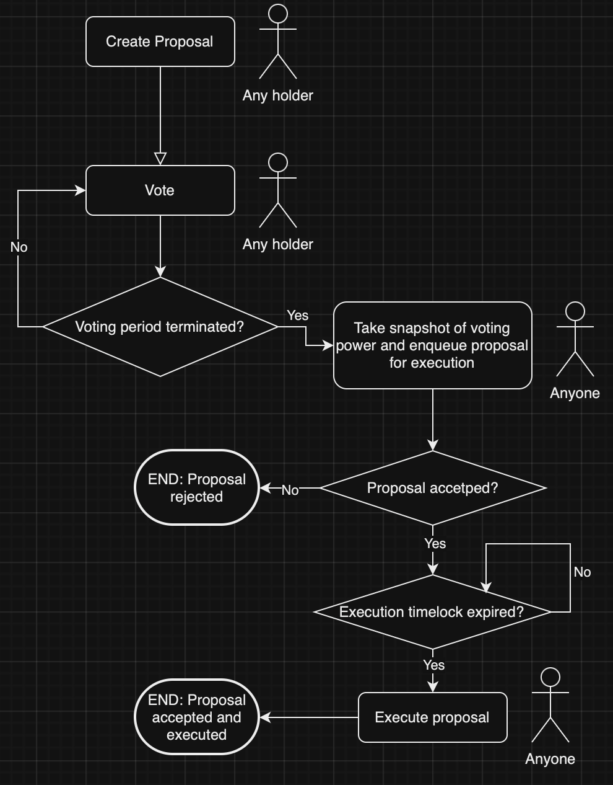

# ERC246 Token Standard

## Overview

This repository contains the implementation of the **ERC246** governance token, which is a standard ERC20 token with integrated governance features. Token holders can propose, vote, and execute governance actions, such as minting tokens, modifying transfer fees, conducting airdrops, or any other configurable governance decision.

The **ERC246** token is designed to be used in decentralized governance systems, allowing users to propose and vote on decisions that affect the behavior and policies of the contract itself.

### Key Advantage: Governance Built Directly Into the Token
One of the most important advantages of **ERC246** is that the governance system is embedded directly into the token. This means developers don’t have to build or integrate separate governance frameworks. As soon as the **ERC246** token is deployed, the token becomes community-owned and governed by token holders, with all necessary governance functions already built in.

This enables projects to launch community-owned tokens faster, with the community having full control from the start. Governance decisions like token minting, treasury management, and transfer fee updates are already part of the contract and can be managed through proposals and voting.

## Governance Process

1. **Proposal Creation**: Token holders create proposals by calling `createProposal()`, specifying the addresses and function calls to be executed if the proposal is accepted.

2. **Voting**: Token holders vote on proposals using their token balance as their voting power. They vote for or against the proposal by calling `vote()`.

3. **Enqueueing**: After the voting period ends, anyone can call `enqueueProposal()` to mark the proposal as ready for execution. When a proposal is enqueued, a snapshot of the current voting power of all voters is taken; voting power is calculated based on token balances. This snapshot determines whether the proposal is accepted or rejected. If the proposal is accepted, enqueueing it starts a timelock after which the proposal will be executable. This timelock serves the purpose of giving holders enough time to exit (e.g., selling their tokens) if they see an enqueued proposal they don't agree with.

4. **Execution**: Once the time-lock period has passed, accepted proposals can be executed via `executeProposal()`, which will execute the encoded function calls defined in the proposal.

  

---

## Governance Parameters and Limits

**ERC246** allows the community to adjust key governance parameters via governance proposals while adhering to predefined limits to ensure security and prevent abuse. Below are the adjustable parameters and their bounds:

### 1. **Voting Duration (`minimumVotingDurationBlocks`)**
   - **Initial Value**: 5760 blocks (~1 day on Ethereum)
   - **Description**: Sets how long proposals remain open for voting.
   - **Governance Adjustable**: Yes, but cannot be set below the minimum allowed.
   - **Bounds**:
     - Minimum: 750 blocks (~2.5 hours, defined by `MINIMUM_ALLOWED_PROPOSAL_DURATION_BLOCKS`)
     - Maximum: No hardcoded maximum (community can set longer durations).

### 2. **Execution Delay (`executionDelayInBlocks`)**
   - **Initial Value**: 1200 blocks (~4 hours on Ethereum)
   - **Description**: Time-lock period between a proposal being accepted and it becoming executable.
   - **Governance Adjustable**: Yes, but cannot be set below the minimum allowed.
   - **Bounds**:
     - Minimum: 750 blocks (~2.5 hours, defined by `MINIMUM_ALLOWED_EXECUTION_DELAY_BLOCKS`)
     - Maximum: No hardcoded maximum (community can set longer delays).

### 3. **Quorum Requirement (`quorumSupplyPercentageBps`)**
   - **Initial Value**: 400 basis points (4%)
   - **Description**: Percentage of total token supply that must vote for a proposal to be valid.
   - **Governance Adjustable**: Yes, but cannot be set below the minimum allowed.
   - **Bounds**:
     - Minimum: 100 basis points (1%, defined by `MINIMUM_ALLOWED_QUORUM_SUPPLY_PERCENTAGE_BPS`)
     - Maximum: No hardcoded maximum (community can set higher quorums).

### 4. **Transfer Fee (`transferFeeBps`)**
   - **Initial Value**: 0 basis points (no transfer fee)
   - **Description**: Sets the fee (in basis points) applied to token transfers.
   - **Governance Adjustable**: Yes, but cannot exceed the maximum allowed.
   - **Bounds**:
     - Minimum: 0 basis points (no fee)
     - Maximum: 500 basis points (5%, defined by `MAX_TRANSFER_FEE_BPS`).

### 5. **Minting Limit (`MAXIMUM_MINT_SUPPLY_PERCENTAGE_BPS`)**
   - **Value**: 500 basis points (5%)
   - **Description**: Limits the percentage of the total token supply that can be minted through a proposal.
   - **Governance Adjustable**: **No**, this is a fixed limit to prevent excessive inflation.

---

## Contracts

### 1. **IERC246.sol**
This is the interface that defines the core methods for governance-related functionality in the **ERC246** standard. It defines the following key functions:

- **`createProposal()`**  
  Allows token holders to create new proposals.

- **`vote()`**  
  Allows token holders to vote on an active proposal.

- **`enqueueProposal()`**  
  Enqueues a proposal for execution after voting ends.

- **`executeProposal()`**  
  Executes an accepted and enqueued proposal after the required time-lock has passed.

- **`deleteProposal()`**  
  Allows the proposer or governance to delete a proposal.

- **`getProposalCurrentOutcome()`**  
  Takes a voting power snapshot for a given proposal, returning the number of votes in favor and against.

#### Events:

- **`ProposalCreated()`**  
  Emitted when a new proposal is created.  
  **Parameters**:
  - `proposalId`: The ID of the proposal.
  - `targets`: The target contract addresses.
  - `data`: The encoded function calls.
  - `values`: The amount of Ether to send with each function call.
  - `deadlineBlock`: The block number at which voting will end.

- **`VoteCast()`**  
  Emitted when a vote is cast on a proposal.  
  **Parameters**:
  - `voter`: The address of the voter.
  - `proposalId`: The ID of the proposal.
  - `support`: Indicates whether the vote was in favor (true) or against (false).

- **`ProposalEnqueued()`**  
  Emitted when a proposal is enqueued for execution.  
  **Parameters**:
  - `proposalId`: The ID of the proposal.
  - `accepted`: Indicates whether the proposal was accepted (true) or rejected (false).

- **`ProposalExecuted()`**  
  Emitted when a proposal is executed.  
  **Parameters**:
  - `proposalId`: The ID of the proposal.
  - `accepted`: Indicates whether the proposal was accepted or rejected.

- **`ProposalRejected()`**  
  Emitted when a proposal is rejected.  
  **Parameters**:
  - `proposalId`: The ID of the proposal.

- **`ProposalDeleted()`**  
  Emitted when a proposal is deleted.  
  **Parameters**:
  - `proposalId`: The ID of the proposal.

### 2. **ERC246.sol**
This is the core implementation of the **ERC246** token, which inherits from the ERC20 standard and implements the **IERC246** interface.

#### Core Governance Functions

- **`createProposal()`**  
  Allows token holders to create a new governance proposal.
  
  **Parameters**:
  - `_title`: A short descriptive title of the proposal (max 30 characters).
  - `_targets`: The addresses of the target contracts to call.
  - `_data`: The encoded function calls (e.g., method signature + parameters) to execute.
  - `_values`: The ETH values to send with each function call.
  - `_votingDurationInBlocks`: The duration for which the proposal will be open for voting.
  
- **`vote()`**  
  Allows token holders to vote on a proposal.
  
  **Parameters**:
  - `_proposalId`: The ID of the proposal to vote on.
  - `_support`: A boolean indicating whether the vote is in favor or against.

- **`enqueueProposal()`**  
  Enqueues a proposal for execution after the voting ends and checks if it meets quorum.

  **Parameters**:
  - `_proposalId`: The ID of the proposal to enqueue.

- **`executeProposal()`**  
  Executes an accepted and enqueued proposal after the required time-lock has passed.

  **Parameters**:
  - `_proposalId`: The ID of the proposal to execute.

- **`deleteProposal()`**  
  Allows the proposer or governance to delete a proposal.

  **Parameters**:
  - `_proposalId`: The ID of the proposal to delete.

#### Functions executable only via proposal accepted by governance

This section showcases functions that can only be executed if they are contained in an accepted proposal.

##### Treasury Functions

- **`transferFromTreasury()`**  
  Transfers tokens from the contract’s balance to a given recipient.

- **`mint()`**  
  Mints new tokens to a specified recipient.

- **`airdropByMinting()`**  
  Allocates tokens to recipients for future airdrop claims by minting new tokens.

- **`airdropFromTreasury()`**  
  Allocates tokens from the contract’s treasury to recipients for future claims.

- **`burnFromTreasury()`**  
  Burns tokens from the contract’s treasury.

##### Governance Configurability

- **`updateTransferFeeBps()`**  
  Updates the transfer fee percentage (in basis points).

- **`updateQuorumSupplyPercentage()`**  
  Updates the quorum supply percentage for proposal acceptance.

- **`updateProposalExecutionDelayBlocks()`**  
  Updates the delay (in blocks) between proposal enqueueing and execution.

- **`updateMinimumVotingDurationBlocks()`**  
  Updates the minimum voting duration for proposals.

- **`updateName()`**  
  Updates the token name.

- **`updateSymbol()`**  
  Updates the token symbol.

#### Utility Functions

- **`claimMintAirdrop()`**  
  Allows recipients to claim their allocated tokens from a minting-based airdrop.

- **`claimAirdropFromTreasury()`**  
  Allows recipients to claim their allocated tokens from a treasury-based airdrop.

---

## Security Considerations
This standard is entirely experimental and unaudited, while testing has been conducted in an effort to ensure execution is as accurate as possible. Please use it with caution. Always audit your smart contracts before deploying them to a production environment.

---

## Conclusion
The **ERC246** standard transforms token governance by embedding community-driven decision-making processes directly into the token contract. With built-in governance, time-locks, and quorum requirements, ERC246 empowers token holders to have direct control over the future of the project.
